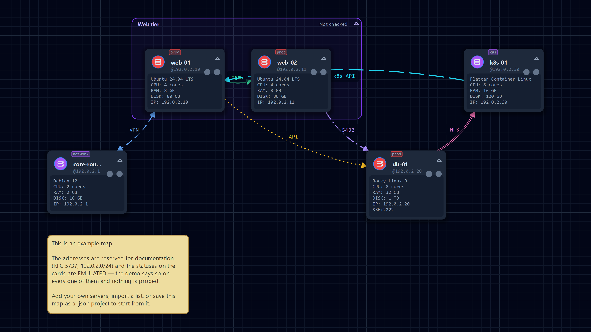

# SSHMap (Visual Node Map + SSH Terminal and SFTP manager)

Desktop application (Python + PySide6): an interactive map of your IT infrastructure with direct SSH connections to nodes.
*"Draw your infrastructure. Organize it. Connect to it."*



*The example map (Help → Open the example map): five servers and six connections — one of every type — plus a group, a
note and tags, all on documentation addresses (`192.0.2.0/24`) with statuses marked as emulated. The picture is
generated from that example map only, by `python tests/_gen_docs_image.py`.*

---

## 1. Features

### Map & canvas
- Server cards with a status, six typed connections (`ssh`, `vpn`, `http`, `database`, `nfs`, `kubernetes`), free and pinned sticky notes, groups and a background image (drag and resize it) — on an infinite zoomable canvas (0.1–5.0).
- A group can be folded into a grid of badges (undoable) and answers for its members: its frame carries the worst member status as a shape plus the counts (`Offline 2 · Warn 1`).
- Multi-selection (Ctrl+click, rubber band), group drag, "connect selected" / "delete selected"; per-server quick launch (URL → browser, command → first line of the SSH session); tags with a sidebar filter — the primary tag colours the card's icon and is written on the card, so the environment is never a colour alone.
- Minimap, legend and an **Export** menu that holds everything which leaves the application: "Copy Map as Image", PNG, JPEG, PDF, SVG and `.drawio` — print-friendly by default (a light page with high-contrast lines), with "use the current theme" as a one-click opt-out. "Save Documentation Image…" writes a fixed 1600×900 @2× poster of the map, and the inventory report (below) sits in the same menu.

### Statuses, facts & diagnostics
- `online` / `warn` / `offline` from parallel SSH probes (TCP + banner) off the GUI thread; a status carries its age and turns grey once it is stale — the status itself never changes, and "Check statuses now" runs a round on demand.
- Collected hardware facts (OS / CPU / RAM / disk / IP) are dated too, and one click gathers them for a selection or the whole map through a bounded queue with progress and a summary that names the failures.
- "Why is it offline?" asks a red card a direct question: DNS resolve → TCP connect → SSH banner → ICMP ping, in order, naming the first failing step in its own words. It explains; it never rewrites the status.
- Trouble first: one click dims everything that is not warn, offline or stale, and a floating plaque names every active filter (search, tag, status, lens) with one × each.

### Terminal & SFTP
- Built-in SSH terminal on a vendored pyte fork: scrollback, full keyboard, mouse selection, alternate screen (vim/htop/less restore the previous screen), wheel passthrough to TUIs, a find bar, clear scrollback / reset screen / save transcript.
- Sessions as tabs in separate windows or in a detachable "Terminals" dock on the map, a split pane with a second shell of the same node, multi-input broadcast with per-session exclusions, and a command library of macros.
- SFTP over the same live transport (no second authentication): a directory tree, upload/download including drag & drop, a file manager (new folder / rename / delete, an overwrite prompt, atomic transfers, rate and ETA) and a read-only text preview (≤ 1 MB) with syntax highlighting and "no preview" row markers.
- External system terminal as an alternative to the built-in one.

### The list becomes a report
- Collapsing the map turns the sidebar into a 13-column table: alias, host (IP), SSH port, user, status, the age of the status, OS, CPU, RAM, disk, the age of the facts, comment and tags.
- Sort by any column — the key follows the data, not the text (`512 MB` before `8 GB`, `10.9.0.1` before `10.10.0.1`, an empty cell last).
- Take it with you: "Copy List as TSV" and "Export List…" (CSV or TSV, UTF-8 with a BOM) in the **Export** menu write exactly the columns and rows you see, in the order you sorted them.

### Look, motion & keyboard
- Dark, light and Auto (system) themes, an accent colour picked as a hue, and a "Reduce motion" switch; the light palette is measured against the surface each tone is drawn on and gated by contrast tests.
- Meaning never lives in a colour alone: each connection type has its own line style, each status its own shape (dot / ring / triangle), and the legend samples both.
- Motion that can be interrupted: camera flights, a scale-in on add, hover focus on a connection — the wheel or a drag always wins.
- Command palette on Ctrl+K, a searchable settings hub (8 tabs), and every one of the 56 global actions assignable in the Hotkeys tab; `?` or F1 opens the shortcut list. The map also works from the keyboard alone (Tab/arrows/Enter).

### Projects & data
- One JSON project file (`.json` / `.sshmap`), a recent-files list, a project dropped onto the window, autosave with a ring of backups, and rollback — an unreadable file offers its newest autosave or backup instead of a dead end.
- A first screen with three doors: add your first server, **open an existing map**, or open the example map.
- Bulk import from a text file (one host per line, DNS resolved off the GUI thread) and from `~/.ssh/config` (with an `Include` recursion and a checkbox picker); a whole import is one undo.
- SSH profiles with passwords in the OS keyring — never in a project file.

### Languages & plugins
- English (default), Russian, Chinese and German, plus any other language as one JSON file in `~/.sshmap/languages/`; a file there shadows the built-in one of the same code, and the Language tab imports and exports files without touching the installed package.
- Plugins from an installed entry point (`sshmap.plugins/v1`) or from one file in `~/.sshmap/plugins/`: a plugin can run a command on selected servers, contribute a status to a card, and add palette commands and node-menu rows. UI hooks are timed and background hooks run on managed threads, so a broken plugin is reported instead of freezing the window.

---

## 2. Install & Run

```bash
pip install -r requirements.txt   # PySide6, paramiko, keyring, wcwidth (pyte is vendored in third_party/pyte)
python main.py                    # run the GUI
pipx install .                    # or pip install . → the `sshmap` command
```

Requirements: Python 3.10+, Windows / Linux / macOS. Settings live in `~/.sshmap/config.json`, plugins in
`~/.sshmap/plugins/`, languages in `~/.sshmap/languages/`, logs in `~/.sshmap/logs/sshmap.log`.

---

## 3. Project Format (JSON files, `.json` / `.sshmap`)

```json
{
  "version": "0.9",
  "servers":  [{"id": "710602ee", "alias": "...", "host": "...", "user": "...",
                "x": 0.0, "y": 0.0, "cpu": "", "ram": "", "disk": "", "ip": "",
                "comment": "", "ssh_port": 22, "key_path": "",
                "os_name": "", "cpu_model": "", "tags": ["prod", "dev"],
                "info_collected_at": 1750000000.0,
                "quick_launch": [{"type": "url", "name": "Webmin", "value": "http://host:10000/"},
                                 {"type": "command", "name": "K9S", "value": "k9s"}]}],
  "connections": [{"source_id": "...", "target_id": "...", "label": "", "type": "ssh", "bidirectional": true}],
  "notes":  [{"id": "...", "text": "", "x": 0.0, "y": 0.0, "width": 240.0, "height": 160.0, "server_id": "..."}],
  "groups": [{"id": "...", "name": "", "x": 0.0, "y": 0.0, "width": 480.0, "height": 320.0}],
  "background": {"path": "/path/to/background.png", "x": 0.0, "y": 0.0, "width": 1920.0, "height": 1080.0},
  "zoom": 1.0, "center_x": 0.0, "center_y": 0.0
}
```

Format invariants:
- `password` is never serialized; it lives only in the OS keyring (the loader normalizes old records but never keeps a password in the file).
- Connection types: `ssh|vpn|http|database|nfs|kubernetes`; an unknown or missing type loads as `ssh` (files from 0.6+ are readable).
- `bidirectional` is optional on a connection record: written only when true, absent means a one-way arrow. A bidirectional arrow draws heads at both ends of the curve.
- Group membership is not stored; it is computed from geometry. Each card joins exactly the topmost group whose rect contains its center, and a folded group keeps only its `collapsed` and `expanded_width/height` fields.
- `tags` is an array of strings; a missing or non-array value in an old file becomes an empty list, and a broken `quick_launch` record is dropped.
- `info_collected_at` is when the collected facts were measured, as epoch seconds. It is written only when a server has one; a missing, null, non-numeric or negative value means "not dated" and the card stays unmarked. The key holds an age, never a status.
- `server_id` on a note is optional: absent means a free note, and a broken reference leaves the note free at its saved position. An attached note keeps its saved position, so a note moved by hand does not jump.
- `background` stores a path to the image, not the file itself; a missing file is logged and ignored. Background geometry is not part of undo.

---

## 4. Security & Limitations

Passwords: keyring only (servers by id, profiles as `"profile:{id}"`). Only an allowlisted system backend is accepted —
Windows Credential Manager (requires `pywin32`, optional in `requirements.txt`), secret-service or netrc on Linux,
keychain on macOS; plaintext fallbacks are rejected. Without a secure backend the app still works, but passwords do not
survive a restart. The external terminal is an OS `ssh` process: the password is entered there, never passed in argv.

**Limitations:**
- TOFU on first connect: a host key that is not in `~/.sshmap/known_hosts` is accepted automatically (the fingerprint is logged). Protection kicks in when an already-recorded key changes, so verify the first-connect fingerprint of a critical host over a trusted channel.
- Undo/redo covers the map (nodes, connections, notes, groups, imports) but not node statuses or background geometry.
- The background image is stored by path: move the file together with the project.
- Plugins run inside the application's process: a plugin with a broken C extension can take it down — install plugins you trust.
- A host key change and an unreadable project are reported, never repaired silently; recovery means an autosave or backup slot.

---

## 5. Development

Everything is plain Python — no build step, no generated sources.

```bash
python main.py                         # run the GUI
python tests/run_all.py                # the whole suite (exit 0 ⇔ all green)
python tests/run_all.py --fast         # daily profile: skips files tagged slow/network
python tests/run_all.py --tag network  # real-network sections run only on this explicit opt-in
python tests/run_all.py --failed-only  # re-run only the files that failed last time
python tests/run_all.py --junit        # JUnit XML report → test-results/junit.xml
python tests/test_tags.py              # a single file, from the project root
python tests/check_i18n_keys.py        # translation parity and the keys used in code
```

Tests are plain scripts without pytest: one topical `test_*.py` file per area, each in an isolated process (sandbox
HOME, offscreen Qt, UTF-8 stdout), plus one parallel runner. `run_all.py` picks the worker count from the CPU count
(capped at 16) and starts the longest files first. The suite map and the harness conventions are in `tests/INDEX.md`.

Contributing rules:
- All code text is English: comments, docstrings, UI strings and test labels. Russian, Chinese and German live only in `i18n/ru.json`, `i18n/zh.json` and `i18n/de.json`.
- A new UI string is a new key in **all** language files at once; each built-in language must cover 100% of `en` in keys, `{placeholder}` names and line breaks. A deliberately incomplete translation may declare `"partial": true`, which downgrades its missing keys to warnings. `check_i18n_keys.py` is the gate.
- A comment explains what the code does today — never when it changed or what it replaced.
- The pyte fork is vendored on purpose: change it only by adding a patch under `third_party/pyte-patches/` and updating that folder's `MANIFEST.md` (provenance, checksums, policy) — never by editing the sources in `third_party/pyte/`.

PySide6 / Qt 6 gotchas worth knowing before writing UI code:

| Issue | Solution |
|---|---|
| Mouse input in QGraphicsView tests | Only `PySide6.QtTest.QTest.mousePress/Move/Release/DClick` works; hand-crafted QMouseEvents are ignored by the core |
| Monkey-patching C++ slots with return values (`itemChange`, `eventFilter`) | FORBIDDEN: infinite recursion or Access Violation 0xC0000005. Only subclass overrides |
| `QPropertyAnimation(target=QGraphicsItem)` | Does not work ("non-existing property opacity") → use QVariantAnimation |
| `QGraphicsItemGroup.boundingRect()` | Not recomputed from children (zero rect) → explicit override |
| `itemChange(ItemPositionChange)` | Called BEFORE the position is applied → pass target rects explicitly |
| QGraphicsProxyWidget "eats" the mouse | Dragging a widget item is handled manually; the view temporarily switches `dragMode` to NoDrag |
| strokeToFill / strokedPath QPainterPath | Not bound in PySide6 → hit zones via a custom `contains()` with curve sampling |
| `QWidget` focusIn/focusOut signals | Do not exist in Qt6 → eventFilter |
| Death of the Python QAction wrapper with an attached QMenu | PySide6 6.11 destroys the C++ QMenu along with it; keep such QActions permanently and avoid `action.menu()` where a direct path exists |
| `QPdfWriter` coordinates | Paints in device pixels at `resolution()` (1200 dpi by default) while the page layout is in points → set the resolution and draw into `device.width()/height()`; a custom page size is transposed for Landscape (pass the portrait form) |

---

## 6. Repository Layout

| Path | What is in it |
|---|---|
| `main.py` | Entry point: logging → QApplication → MainWindow → plugin discovery → status checks |
| `version.py` | `APP_VERSION` and `VERSION_FORMAT` — the single source of truth |
| `models/` | `ServerData` (a password is never serialized), SSH profiles |
| `graphics/` | The scene and its items: cards, typed arrows, notes, groups, background, the minimap |
| `modules/` | Terminals, SFTP, the pyte fork seam, plugins, the command library, undo commands, logging |
| `storage/` | Project save/load, the example map, autosave with backups, the `.drawio` writer |
| `services/` | Credentials, probes, reachability diagnostics, info batches, importers |
| `dialogs/` | Add/edit dialogs, connect, profiles, backups, imports, export options |
| `ui/` | Main window and mixins, sidebar, theme, palette, panels, settings, hotkeys, icons |
| `i18n/` | `en` (reference), `ru`, `zh`, `de` — one JSON file per language |
| `tests/` | 102 test files, the parallel runner and the harness — map in `tests/INDEX.md` |
| `examples/plugins/` | Two working example plugins, not installed and never auto-discovered |
| `third_party/pyte/`, `third_party/pyte-patches/` | The managed pyte 0.8.2 fork: sdist plus explicit patches, provenance in the patches' `MANIFEST.md` |
| `docs/` | The map image above, rendered from the example map |
| `PLUGINS.md` | The plugin contract (API v1): manifest, hooks, context, isolation |
| `pyproject.toml`, `requirements.txt` | Installable identity (`sshmap` command) and the dependencies |
| `LICENSE` | MIT |
