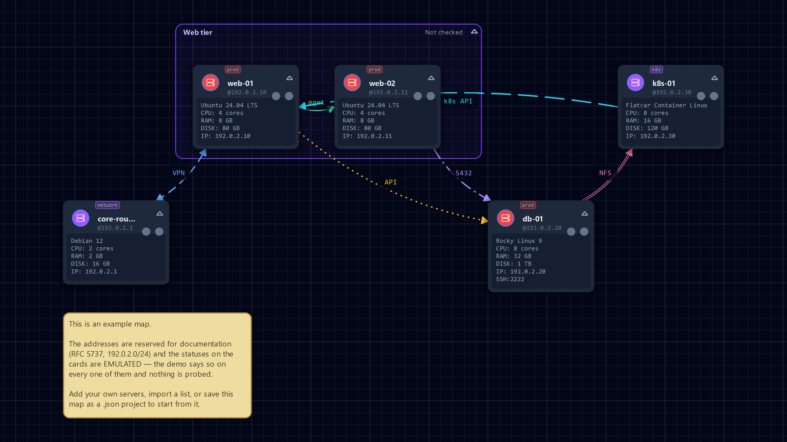

# SSHMap (Visual Node Map + SSH Terminal and SFTP manager)

Desktop application (Python + PySide6): an interactive map of your IT infrastructure with direct SSH connections to nodes.
*"Draw your infrastructure. Organize it. Connect to it."*



*Help → Open the example map: five servers and six connections - one of every type - a group, a note and tags, all on documentation addresses (`192.0.2.0/24`) with statuses emulated. The picture is generated from that file by `python tests/_gen_docs_image.py`.*

---

## 1. Features

### Map & canvas
- Server cards with status marks, six typed connections (`ssh`, `vpn`, `http`, `database`, `nfs`, `kubernetes`), free and pinned sticky notes, groups and a background image (drag it, resize it) - on an infinite zoomable canvas (0.1–5.0).
- Draw a connection two ways: hold `Shift` and drag from one card to another, or pick **"Connect to…"** in the card's right-click menu. Both open the same dialog with the source filled in; its From/To pickers are typed into - part of a name or an address narrows the list.
- A group folds into a grid of badges (undoable); its frame carries the worst member status as a shape plus the counts (`Offline 2 · Warn 1`). Lining up a group's members in one gesture (a vertical line, a horizontal line, rows of N) moves cards and is one undo step; the frame itself never resizes, so a card pushed outside it leaves the group - Ctrl+Z brings the whole arrangement back.
- Multi-selection (Ctrl+click, rubber band), group drag, connect/delete selected, **bulk edit** of tags, comment and quick launch in one undo step (every field "leave unchanged" by default). Per-server quick launch: a URL opens your browser, a command lands as the first line of an SSH session. Tags filter the sidebar; the primary tag colours the card's icon and is written on it - the environment is never a colour alone.
- A density switch (Comfortable / Compact) in settings keeps maps of hundreds of nodes readable: the compact card keeps alias, host and status marks and drops the information block. Several connections between the same pair are drawn as parallel arcs; dragging the background image comes back with Ctrl+Z.
- Minimap, legend and an **Export** menu holding everything that leaves the application: "Copy Map as Image", PNG, JPEG, PDF, SVG and `.drawio` - print-friendly by default (a light page, high-contrast lines), "use the current theme" is a one-click opt-out. "Save Documentation Image…" writes a fixed 1600×900 @2× poster of the map; the two data reports below sit in the same menu.
- **Bookmarks**: one place for the links the team uses - a wiki, a dashboard, a hypervisor's console. The panel lists every entry as a name with its address under it, filters as you type, opens on double click or Enter and remembers its state between runs; "Edit bookmarks…" adds, edits in place, reorders and removes entries. It lives in `~/.sshmap/bookmarks.json`, outside every project - a shared map never carries another machine's links.

### Statuses, facts & diagnostics
- `online` / `warn` / `offline` from parallel SSH probes (TCP + banner) off the GUI thread. A status carries its age and turns grey once stale; "Check statuses now" runs a round on demand. The cadence has a third setting - **manual only** (`status_interval_sec = 0`, or the checkbox in the Status Checks tab): nothing is probed at startup or when a project opens, the age of a status becomes the only signal, and one older than a day is marked stale.
- Hardware facts (OS / CPU / RAM / disk / IP) carry an age too; one click gathers them for a selection or the whole map through a bounded queue with progress, and the summary names the failures.
- The disk facts read **two** filesystems: the root and the node's **data mount** (a per-card path, `/opt` by default), so a server whose capacity lives on another volume reports that volume (`DISK /opt: 48 gb free of 59 gb`) instead of only the root's small number.
- A card can also be told **which disk it is about**: the Add/Edit dialog lists the physical disks the last collection found (`lsblk -d`) and the chosen one answers the card's `DISK` line with its own capacity (`DISK: SDB 100 gb`) - a server whose real volume is `/dev/sdb` no longer hides 100 gb behind the root's 9.7 gb. Leave the field empty and nothing changes: the root's figure is reported as before. The choice is a NAME, never a number - a typed figure is only what a collection measured - and the list of every disk it saw rides the card's tooltip. A chosen device that is no longer in the listing (disk names move when hardware is added) is reported in the status bar and the card shows no capacity figure at all rather than another disk's number.
- "Why is it offline?" asks a red card directly: DNS resolve → TCP connect → SSH banner → ICMP ping, naming the first failing step in its own words. It explains; it never rewrites the status.
- Trouble first: one click dims everything that is not warn, offline or stale, and a floating plaque names every active filter (search, tag, status, lens) with one × each.
- **The neighbours on the map:** mark a server as **unmanaged** and it keeps its place in the diagram without pretending - no credentials stored, no probe round ever touches it, no SSH verb reaches it; its band carries a "no ssh" mark and its tooltip says "not monitored". The honest answer for a box nobody here administers. A per-card ping exists behind an opt-in switch; its result is a manual note, never a status.

### Terminal & SFTP
- Built-in terminal on the vendored pyte fork: scrollback, full keyboard, mouse selection, alternate screen (vim/htop/less restore the previous screen), wheel passthrough to TUIs, a find bar, clear / reset / save transcript. Every glyph is drawn at its own grid cell - emoji sequences and combining marks count as one cell - so frames stay aligned with whatever monospace font you pick.
- A full-screen program that asks for the mouse protocol gets it: clicks, drags and releases are reported to it instead of being swallowed by local selection; `Shift` keeps the selection and scrollback yours, and stays your exit if a crashed program left mouse mode on (hold it to scroll). VT100 line graphics render as frames (`mc`, `dialog`), and a session whose server went away says so instead of freezing on a blinking cursor.
- The cursor is a thin blinking bar out of the box; Bar, Block or Underline in the Terminal tab. The font zooms with `Ctrl`+wheel by one point and remembers its size across restarts.
- Sessions as tabs in separate windows, in a detachable "Terminals" dock on the map, or in ONE shared window (Settings → Terminal → *Single window*): every new connection joins the window you already have, whatever server it belongs to. `Merge Windows` on a window's context menu collects the sessions of the other open windows into it - the sessions move as they are, so scrollback, command history and running transfers survive. A tab that produced output while you were elsewhere gets a dot, cleared when you switch to it.
- `Split Terminal` gives you a second shell of the same node below the tabs - in a window and in the dock alike. The split belongs to the session that is on screen: switch to another tab and the pane keeps running (it is a session too), press the button there and the split MOVES to that session after asking about the one it leaves. The button's tooltip names the session it belongs to.
- A tab names its server, and the tooltip carries the title the remote program sets (`OSC 0`/`OSC 2`), so a shell running `vim`, `tail -f` or a build says what it is; the window title names the session you are looking at. Multi-input broadcasts to several sessions, per-session exclusions included; a command library holds macros.
- **A command you proved on a server becomes a macro in one gesture**: right-click a row of a session's `History` tab and pick *Send to Commands…* - the usual form opens with the command and a name already filled in, you choose the category, and the row joins the library. A row that looks like it carries a secret is refused with one sentence instead of being stored. The library is a real file: every change keeps the previous version in a ring of ten, *Restore from a backup…* in the panel's menu brings any of them back, and *Import…* / *Export…* carry the whole library to another machine as JSON - an imported file asks before it replaces what you have, and an exported one can be dropped in as `commands.json` itself.
- SFTP over the same live transport - no second authentication: a directory tree with a typed address bar (`~` and relative paths resolved by the server, names completed as you type), upload/download including drag & drop, a file manager (new folder / rename / delete, an overwrite prompt, atomic transfers, rate and ETA) and a read-only preview (1 MB by default, sized in Settings → Files) with syntax highlighting.
- **Files Commander**: the corner button of the session tab bar opens two directory panes side by side in one tab, each with its own address bar, listing and preview. The pane you last clicked is the active one - outlined, its keys yours; `Tab` / `Shift+Tab` moves between them. `F3` views a row, `F5` copies and `F6` moves the selection into the other pane's directory, `F7` makes a folder, `F8` deletes it, `Enter` opens, `Insert` or space marks a row and steps down so several files can be picked without the mouse, `Backspace` goes one level up. The preview opens **in the other pane** - this one keeps its cursor; with one pane it opens in place. One preview at a time; `Esc` closes it from either pane. All of these keys live inside the Files tab only: an `F3`–`F8` typed into a shell still reaches the shell (with one pane, `F6` renames in place).
- **Follow the shell's directory** - off by default: a hook appended to your `PROMPT_COMMAND` moves the listing on every `cd`. In two-pane mode it is greyed out; one shell cannot answer for two panes.
- **Send to ▸ another session**: the context menu of a file row sends it to any other open session that has its Files listing ready. The dialog names the file and the folder it comes from, offers the target's folders and asks about an existing file with both sides' size and date. Same server *and* same login - the file is copied on the server itself, and the dialog names the login it runs as; a different server, or a different login on the same server - it is relayed through this computer, one file at a time, up to 100 MB. The transferred copy is atomic and cancelled transfers leave nothing behind.
- The two panes remember each server's directory: come back to that server and each pane opens where you left it (a folder that no longer exists falls back with one status line). A row dragged from one pane into the other is copied there, or moved with `Shift`; a drop from another session's pane is refused and points at *Send to*.
- **Sort any listing by a column**: click `Name`, `Size` or `Modified` in the header to sort, click it again to reverse. Folders stay grouped above the files and `..` stays on top whatever the order, in both panes and on both sides.
- **The size a preview reads is yours**: Settings → Files sets the ceiling (1 MB by default, up to 250 MB, with a warning above 3 MB). A bigger file opens instead of being refused - the header says *the first 1.0 MB of 4.0 GB*, so a huge log is readable at once.
- The preview wraps long lines on request: right-click in the reader and pick **Word wrap** (one setting for all readers, kept across restarts).
- **The local pane**: the Files Commander's second pane can read the filesystem of this computer - `Server | Local` in its address row - so a server folder and a folder of your own disk sit side by side. The listing, the typed address bar (`~`, relative paths, a UNC share), the read-only preview, new folder / rename / delete and the drag & drop all work the same way on either side, and `F5` copies across: one file - or a whole folder, as a tree - travels from this computer to the server and back, byte for byte and atomically, with the same overwrite question and the same closing report. `F6` moves inside one side; between the two sides `F5` is the copy and removes nothing. A row dragged out of a local pane carries a real OS path, so dropping it into Explorer or an editor works; files dropped from Explorer onto the local pane are copied there locally, and onto the server pane uploaded. Deleting a local entry is permanent: the confirmation says so, because there is no recycle bin.
- **An elevated pane**: `Elevated` in the Files Commander's second pane reads the server as ANOTHER user through `sudo` - the `/etc`, `/var/log` or colleague's home your shell can already touch but the session's own account cannot. It lists, opens and downloads; it never writes: upload, new folder, rename, delete, and any copy or move with that pane at either end answer one sentence instead. sudo's password is asked once, goes to sudo alone on its own channel, is never stored, and the elevation ends with the pane - switch the source away, or lose the connection, and the session's own account is back.
- **Files display mode** (Settings → Terminal): *Files tab* (the default) keeps the tree in the session's own `Files` tab; *Panel beside the shell* lays the active session's tree out as a right-hand column instead, so a wide window shows `[commands | terminal | files]` at once (standalone windows only - in dock mode the setting is ignored). The tab hides while the panel is on and comes back when you switch the mode off; each session keeps its own page with the directory it was browsing. The panel folds to a 24 px strip, and it is mutually exclusive with the Commander: switching the mode off brings your two-pane view straight back. A single window can be switched on the spot from its context menu without changing the setting.
- A **History** tab per server, kept between sessions: import from disk or the server's `~/.bash_history` over SFTP, filter and sort by command, last use or repeat count; copy a row, send it back to the terminal, delete one, merge duplicates, clear the list. A command that looks like it carries a secret is kept **and** marked with a padlock - the mark is a warning, not redaction.
- Set `terminal_scroll` to `"pin"` in `~/.sshmap/config.json` if you would rather keep reading history while a build talks; typing or pasting returns you to the live line (the default `"live"` pulls the view back on new output). An external system terminal (`ssh`) works as an alternative to the built-in one.

### The list becomes a report
- Collapsing the map turns the sidebar into a 13-column table: alias, host (IP), SSH port, user, status and its age, OS, CPU, RAM, disk and the facts' age, comment, tags.
- Sort by any column - the key follows the data, not the text (`512 MB` before `8 GB`, `10.9.0.1` before `10.10.0.1`, an empty cell last).
- **Export** writes what you see: "Copy List as TSV" and "Export List…" (CSV or TSV, UTF-8 with a BOM) in the order you sorted; "Export Connections…" one row per link with both endpoints, type, direction and the bidirectional flag; "Export Problems…" the warn / offline / stale set with status, reason and check age. A map with nothing to report says so instead of writing an empty file.

### Look, motion & keyboard
- Dark, light and Auto (system) themes, an accent colour picked as a hue, a "Reduce motion" switch; the light palette is measured against each surface it is drawn on and gated by contrast tests. Meaning never lives in a colour alone: every connection type has its own line style, every status its own shape (dot / ring / triangle), and the legend samples both.
- Motion can be interrupted - camera flights, a scale-in on add, hover focus on a connection; the wheel or a drag always wins.
- Command palette on Ctrl+K, a searchable settings hub (8 tabs), all 62 global actions assignable in the Hotkeys tab; `?` or F1 opens the shortcut list. The map works from the keyboard alone (Tab / arrows / Enter).

### Projects & data
- One JSON project file (`.json` / `.sshmap`); a recent-files list, a project dropped onto the window, autosave with a ring of backups - an unreadable file offers its newest autosave or backup instead of dead ends.
- The first screen has three doors: add your first server, **open an existing map**, or open the example map.
- Bulk import from a text file (one host per line) and from `~/.ssh/config` (`Include` recursion, checkbox picker); DNS resolves off the GUI thread; a whole import is one undo step.
- SSH profiles with passwords in the OS keyring - never in a project file.

### Languages & plugins
- English (default), Russian, Chinese and German - plus any language as one JSON file dropped into `~/.sshmap/languages/`; a file there shadows the built-in of the same code, and the Language tab imports and exports files without touching the installed package.
- Plugins from an entry point (`sshmap.plugins/v1`) or one file in `~/.sshmap/plugins/`: run a command on selected servers, contribute a status to a card, add palette commands and node-menu rows. A broken plugin is reported instead of freezing the window.
- The Plugins window (Plugins menu) puts the plugins with their switch on the left, the servers to run on in the middle and what each run reported on the right - with a text export of the visible lines. The history lives until the application exits.

---

## 2. Install & Run

```bash
pip install -r requirements.txt   # PySide6, paramiko, keyring, wcwidth (pyte is vendored in third_party/pyte)
python main.py                    # run the GUI
pipx install .                    # or pip install . → the `sshmap` command
```

Requirements: Python 3.10+, Windows / Linux / macOS. Settings live in `~/.sshmap/config.json`, plugins in
`~/.sshmap/plugins/`, languages in `~/.sshmap/languages/`, logs in `~/.sshmap/logs/sshmap.log`.

---

## 3. Project Format (JSON files, `.json` / `.sshmap`)

```json
{
  "version": "0.9",
  "servers":  [{"id": "710602ee", "alias": "...", "host": "...", "user": "...",
                "x": 0.0, "y": 0.0, "cpu": "", "ram": "", "disk": "", "ip": "",
                "comment": "", "ssh_port": 22, "key_path": "",
                "os_name": "", "cpu_model": "", "tags": ["prod", "dev"],
                "info_collected_at": 1750000000.0,
                "quick_launch": [{"type": "url", "name": "Webmin", "value": "http://host:10000/"},
                                 {"type": "command", "name": "K9S", "value": "k9s"}]}],
  "connections": [{"source_id": "...", "target_id": "...", "label": "", "type": "ssh", "bidirectional": true}],
  "notes":  [{"id": "...", "text": "", "x": 0.0, "y": 0.0, "width": 240.0, "height": 160.0, "server_id": "..."}],
  "groups": [{"id": "...", "name": "", "x": 0.0, "y": 0.0, "width": 480.0, "height": 320.0}],
  "background": {"path": "/path/to/background.png", "x": 0.0, "y": 0.0, "width": 1920.0, "height": 1080.0},
  "zoom": 1.0, "center_x": 0.0, "center_y": 0.0
}
```

Format invariants:
- `password` is never serialized - it lives only in the OS keyring; the loader normalizes old records but never keeps a password in the file.
- Connection types: `ssh|vpn|http|database|nfs|kubernetes`; an unknown or missing type loads as `ssh` (files from 0.6+ are readable). `bidirectional` is written only when true - absent means one-way, and a bidirectional arrow draws heads at both ends of the curve.
- Group membership is not stored: each card joins exactly the topmost group whose rect contains its center; a folded group keeps only its `collapsed` and `expanded_width/height` fields.
- `tags` is an array of strings (a broken value in an old file becomes empty); a broken `quick_launch` record is dropped.
- `info_collected_at` dates the collected facts as epoch seconds - it holds an age, never a status; missing or invalid means "not dated".
- A note's `server_id` is optional: absent means a free note, and a broken reference leaves the note free at its saved position. An attached note keeps its saved position, so one moved by hand does not jump.
- `background` stores a path to the image, not the file itself - move it together with the project; a missing file is logged and ignored. Background geometry is not part of undo.

---

## 4. Security & Limitations

Passwords: keyring only (servers by id, profiles as `"profile:{id}"`). Only an allowlisted system backend is accepted -
Windows Credential Manager (`pywin32`, optional in `requirements.txt`), secret-service or netrc on Linux,
keychain on macOS; plaintext fallbacks are rejected. Without a secure backend the app still works, but passwords do not
survive a restart. The external terminal is an OS `ssh` process: the password is entered there, never passed in argv.

**Limitations:**
- A host key is never trusted in silence: a key missing from `~/.sshmap/known_hosts` opens a window with its algorithm and SHA256 fingerprint, and only an explicit accept pins it - verify a critical host's fingerprint over a trusted channel, since a first contact has nothing to compare against. A key that CHANGED shows both fingerprints and offers to replace the stored one, which is also the recovery path after a server is rebuilt. Profile -> Known hosts lists what is recorded, deletes one fingerprint (the next connection asks again) or replaces it with the key the server presents now, read without authenticating. That file is written atomically and re-read before every addition, so two connections never overwrite each other's keys; if it cannot be read, the session says so and runs **unpinned** instead of pretending the key was saved.
- A host that asks for a SECOND FACTOR after accepting your key is answered in a window of this application, and an encrypted private key asks for its passphrase the same way - only when the file really needs one. Closing that window cancels the connection with a sentence instead of hanging on a prompt written to a console nobody is watching. Neither the code nor the passphrase is stored anywhere: not a config key, not a project field, not a log line.
- A stored password belongs to the endpoint it was saved for (`user@host:port`): change a card's host, user or port and the saved password is not offered to the new address - the connect dialog says so and asks for it again. Entries saved before this rule are adopted once, for the address the card names at that moment. A profile password is deliberately not bound this way: a profile is a reusable credential you attach to a node.
- `~` and relative paths work wherever a local path is typed or stored - a private key file, the map background image; an absolute path is used exactly as written.
- The external terminal hands `ssh` a command line, so a host, a user or a jump host is accepted only when it is a plain name (`letters, digits, . - _ : [ ]`); anything a shell or a terminal parser could read as its own syntax is refused with a sentence, and the built-in terminal has no such limit. A key path is never restricted - a path with `&` is legal and works.
- A quick-launch link and a bookmark open `http://` and `https://` only. The OS opener accepts any registered protocol handler and, on Windows, `webbrowser.open()` *is* `os.startfile()`, so a value from a foreign project could otherwise run a local file or a URI handler; the entry itself is kept, only the open is refused.
- A remote name is checked before it becomes a local path: a download whose server-side name is invalid on this system (a path separator, a reserved device name such as `NUL`, a trailing dot or space) is refused with a sentence instead of writing outside the chosen folder or into a device. On Linux the same names are legal and are accepted.
- Undo/redo covers the map (nodes, connections, notes, groups, imports, bulk edits, background image, group arrangements) but not node statuses.
- An unreadable project is reported, never repaired silently; recovery means an autosave or backup slot.
- Plugins run inside the application's process: a plugin with a broken C extension can take it down - install plugins you trust.
- The command history is a plain-text file per server under `~/.sshmap/history/`: what the app sent or you imported, so it can carry secrets (a token or password passed as an argument). Passwords typed into a shell are not recorded; a secret-shaped command is marked with a padlock but still kept. The file never enters a project, an export or the log.
- The bookmarks list is plain JSON in `~/.sshmap/bookmarks.json`, outside every project and never exported - a link may carry a token in its query string, so treat it like the history: it holds what you put there, and opening an entry hands the address to your browser.
- An **unmanaged** card is never monitored or contacted: connect, built-in terminal, external terminal, SFTP, gather information, "Check statuses now", "Why is it offline?" and a quick-launch *command* are all disabled with the reason in their tooltip. Copying its address, revealing, duplicating, grouping, tagging, notes, search and every export keep working; a quick-launch **URL** still opens (the browser needs no shell on that host).
- The data mount of a card is a path YOU give (`/opt` by default): the card reports whatever filesystem `df` really answers for it - `/` when the path has none of its own. A network mount (`nfs`, `cifs`, `smb`, `sshfs`) is never reported as capacity: a share is somebody else's disk, and the refusal is a line in the status bar rather than a number. The disk YOU name for a card wins over the root's figure, and both are stored as plain sizes, so the list view's `disk` column keeps sorting numerically.
- The Files Commander's two panes share ONE SFTP channel of their session (one authentication, one queue): a long transfer queues behind, not parallel with, the other pane's operations, and Cancel stops that shared queue. Every file lands atomically - a cancelled or failed transfer leaves the destination exactly as it was; the overwrite question is asked once for a whole batch ("Apply to all"), and one closing line reports how many were copied, skipped and failed. It downloads, uploads, renames, copies, moves and deletes - it never edits a remote file, and every preview is read-only: edit a config on the server, in an editor you trust, not through this window.
- Copying or moving a folder walks it in one operation bounded at 5000 entries / 32 levels deep per go, then names the file it stopped on instead of half-copying - split a huge folder into parts. A symlink is not followed: the SFTP protocol cannot read a link target, so a link to a file lands as its content and a link to a folder is refused by the server.
- An **elevated** pane reads the server as another user (`sudo`) with that user's rights, READ-ONLY: it lists, opens and downloads, while every write path (upload, new folder, rename, delete, a copy or a move with that pane at either end) is refused with one sentence. `sudo -n -l` decides what the host allows before a channel is opened, the password is typed per elevation and reaches sudo's own STDIN on a separate channel - never a command line, a log or a file - and the elevation is dropped with the pane (a source switch, a closed session or a lost connection). It is not a config key and never enters a project.
- The local pane of the Files Commander works on THIS computer's disk with your own rights: it copies, moves, renames and deletes real files, and a delete there is permanent (no recycle bin). A folder crosses between the two sides as a whole tree under the same bounds as a server-side copy, a folder SYMLINK is never followed, and `F5` never removes an original - only `F6` inside one side moves one.
- A move between directories is one atomic rename inside one filesystem; across two filesystems (a data disk, a network mount) the server refuses it and says so - copy the item, then delete the original. Moving into an existing same-name folder merges them file by file; the source leaves only once empty.
- **A file sent between two sessions of DIFFERENT servers is relayed through this computer**, so a copy of it lands in the OS temporary folder for the duration of the transfer (the tightest permissions the platform offers). That copy is deleted when the send succeeds, fails or is cancelled, and leftovers of a crashed run are swept at the next start - nothing of it is logged, kept or written into a project. Between two sessions of the SAME server the file never leaves the server, and a file over 100 MB is refused before anything is transferred.

---

## 5. Development

Everything is plain Python - no build step, no generated sources.

```bash
python main.py                         # run the GUI
python tests/run_all.py                # the whole suite (exit 0 ⇔ all green)
python tests/run_all.py --fast         # daily profile: skips files tagged slow/network
python tests/run_all.py --tag network  # real-network sections run only on this explicit opt-in
python tests/run_all.py --failed-only  # re-run only the files that failed last time
python tests/run_all.py --junit        # JUnit XML report → test-results/junit.xml
python tests/test_tags.py              # a single file, from the project root
python tests/check_i18n_keys.py        # translation parity and the keys used in code
```

Tests are plain scripts without pytest: one topical `test_*.py` file per area, each in an isolated process (sandbox HOME, offscreen Qt), plus one parallel runner that picks the worker count from the CPU count (capped at 16) and starts the longest files first. The suite map and harness conventions are in `tests/INDEX.md`.

Contributing rules:
- All code text is English: comments, docstrings, UI strings and test labels. Russian, Chinese and German live only in `i18n/ru.json`, `i18n/zh.json` and `i18n/de.json`.
- A new UI string is a new key in **all** language files at once; each built-in language must cover 100% of `en` (keys, `{placeholder}` names, line breaks). A deliberately incomplete translation may declare `"partial": true`, which downgrades its missing keys to warnings. `check_i18n_keys.py` is the gate.
- A comment explains what the code does today - never when it changed or what it replaced.
- The pyte fork is vendored on purpose: change it only by adding a patch under `third_party/pyte-patches/` and updating that folder's `MANIFEST.md` (provenance, checksums, policy) - never by editing the sources in `third_party/pyte/`.

PySide6 / Qt 6 gotchas worth knowing before writing UI code:

| Issue | Solution |
|---|---|
| Mouse input in QGraphicsView tests | Only `PySide6.QtTest.QTest.mousePress/Move/Release/DClick` works; hand-crafted QMouseEvents are ignored by the core |
| Monkey-patching C++ slots with return values (`itemChange`, `eventFilter`) | FORBIDDEN: infinite recursion or Access Violation 0xC0000005. Only subclass overrides |
| `QPropertyAnimation(target=QGraphicsItem)` | Does not work ("non-existing property opacity") → use QVariantAnimation |
| `QGraphicsItemGroup.boundingRect()` | Not recomputed from children (zero rect) → explicit override |
| `itemChange(ItemPositionChange)` | Called BEFORE the position is applied → pass target rects explicitly |
| QGraphicsProxyWidget "eats" the mouse | Dragging a widget item is handled manually; the view temporarily switches `dragMode` to NoDrag |
| strokeToFill / strokedPath QPainterPath | Not bound in PySide6 → hit zones via a custom `contains()` with curve sampling |
| `QWidget` focusIn/focusOut signals | Do not exist in Qt6 → eventFilter |
| Death of the Python QAction wrapper with an attached QMenu | PySide6 6.11 destroys the C++ QMenu along with it; keep such QActions permanently and avoid `action.menu()` where a direct path exists |
| `QPdfWriter` coordinates | Paints in device pixels at `resolution()` (1200 dpi by default) while the page layout is in points → set the resolution and draw into `device.width()/height()`; a custom page size is transposed for Landscape (pass the portrait form) |

---

## 6. Repository Layout

| Path | What is in it |
|---|---|
| `main.py` | Entry point: logging → QApplication → MainWindow → plugin discovery → status checks |
| `version.py` | `APP_VERSION` and `VERSION_FORMAT` - the single source of truth |
| `models/` | `ServerData` (a password is never serialized), SSH profiles |
| `graphics/` | The scene and its items: cards, typed arrows, notes, groups, background, the minimap |
| `modules/` | Terminals, SFTP, the pyte fork seam, plugins, the command library and history, undo commands, logging |
| `storage/` | Project save/load, the example map, autosave with backups, the `.drawio` writer |
| `services/` | Credentials, probes, reachability diagnostics, info batches, importers |
| `dialogs/` | Add/edit dialogs, connect, profiles, backups, imports, export options |
| `ui/` | Main window and mixins, sidebar, theme, palette, panels, settings, hotkeys, icons |
| `i18n/` | `en` (reference), `ru`, `zh`, `de` - one JSON file per language |
| `tests/` | 133 test files, the parallel runner and the harness - map in `tests/INDEX.md` |
| `examples/plugins/` | Two working example plugins, not installed and never auto-discovered |
| `third_party/pyte/`, `third_party/pyte-patches/` | The managed pyte 0.8.2 fork: sdist plus explicit patches, provenance in the patches' `MANIFEST.md` |
| `docs/` | The map image above, rendered from the example map |
| `PLUGINS.md` | The plugin contract (API v1): manifest, hooks, context, isolation |
| `pyproject.toml`, `requirements.txt` | Installable identity (`sshmap` command) and the dependencies |
| `LICENSE` | MIT |
